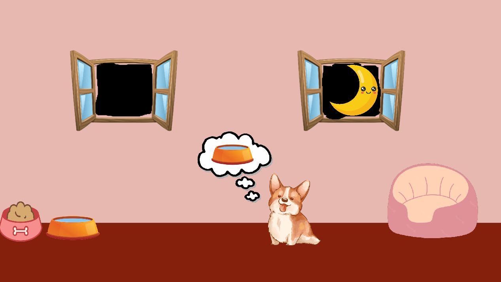

A dog in the middle of the screen will think about what it needs. If it thinks about water click the water bowl, if it needs food click the food bowl, and if it needs to sleep click its bed.

To run the code download the entire file and run the "Pet_simulator.py" file, also be sure to download pygame.